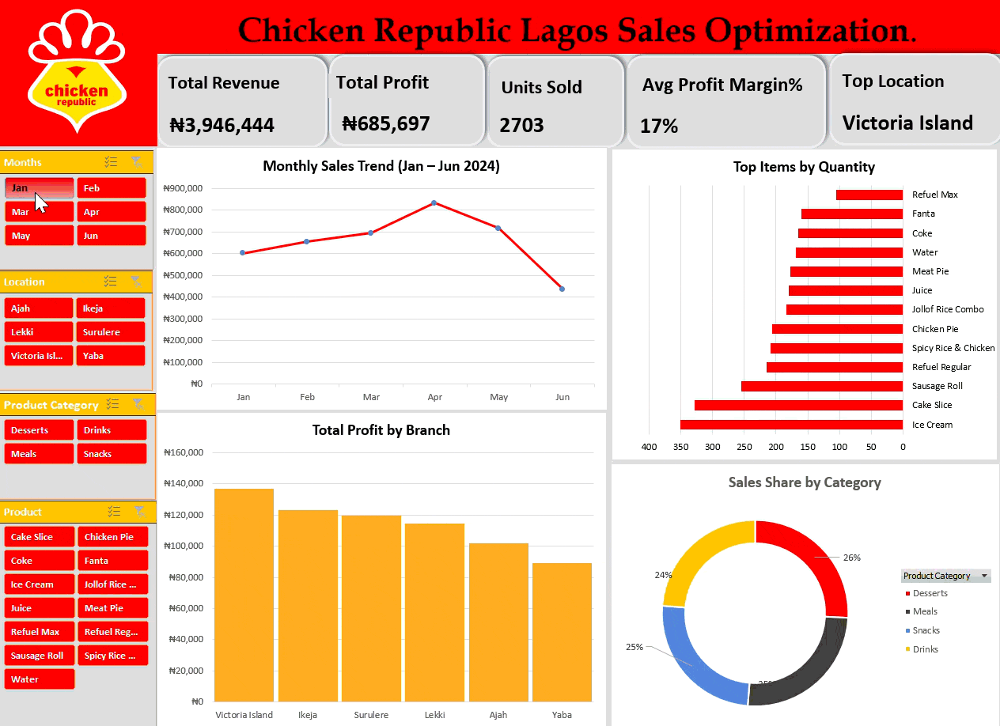

# Chicken Republic Lagos: Executive Sales Optimization Dashboard

## Project Overview
An interactive executive sales dashboard built in Microsoft Excel to analyze revenue, product volume, and branch profitability for Chicken Republic locations across Lagos, Nigeria, covering transaction data from **January to June 2024**.

---
## Project Overview

## Data Cleaning & Transformation Pipeline
Prior to visual modeling, raw transaction data was audited and standardized:
* **Duplicate Auditing:** Checked dataset for duplicate order rows using `Remove Duplicates` to ensure an accurate count across all 2,703 units sold.
* **Data Type Standardization:**
  * Standardized `Date` values to Short Date format (`YYYY-MM-DD`) to enable monthly grouping.
  * Formatted monetary fields (`Unit Price`, `Sales (NGN)`, `Profit (NGN)`) as Currency (`₦`).
  * Explicitly formatted `Quantity` as Integer to ensure accurate numeric aggregation.
* **Row-Level Feature Engineering:**
  * `Cost (NGN)` = `[Sales] - [Profit]`
  * `Profit Margin (%)` = `[Profit] / [Sales]`

---

## Analytics & PivotTable Modeling
Rather than hardcoding static formulas, PivotTables were leveraged to calculate key aggregated metrics dynamically:
* **Monthly Sales Aggregation:** Grouped transaction dates into monthly bins (Jan–Jun 2024) for time-series trend tracking.
* **Branch & Category Performance:** Summarized `Sales` and `Profit` across locations (Victoria Island, Ikeja, Lekki, Yaba, Surulere, Ajah) and product categories (Meals, Drinks, Desserts, Snacks).
* **Volume Distribution:** Calculated total unit sales per item (e.g., Ice Cream, Refuel Regular) to isolate high-volume foot-traffic drivers versus high-margin items.
* **KPI Helper Range Integration:** Built dedicated helper ranges using dynamic `=SUM()` and division formulas off the PivotTable grids to feed dashboard KPI cards without reference errors during Slicer filtering.

---

## Key Dashboard Metrics & Features
* **Dynamic KPI Summary Cards:** Total Revenue, Total Profit, Units Sold, Profit Margin (%), and Top Performing Location.
* **4-Chart Visual Grid:**
  * **Line Chart:** `Monthly Sales Trend (Jan – Jun 2024)`
  * **Horizontal Bar Chart:** `Top Items by Quantity` (sorted highest-to-lowest via reversed axis options)
  * **Column Chart:** `Total Profit by Branch`
  * **Donut Chart:** `Sales Share by Category`
* **Custom Interactive Slicers:** Brand-styled Slicers (*Months*, *Location*, *Product Category*, *Product*) connected across all PivotTables via Report Connections for real-time dashboard filtering.

---

## Technical Skills Demonstrated
* Data Auditing & Cleaning in Excel
* Feature Engineering & Math Logic
* PivotTable Aggregations & PivotCharts
* Range Helper Logic (`SUM`, Dynamic Mapping for UI Shapes)
* Dashboard UI/UX Design & Brand Color Palette Integration (Red `#DD3333` & Gold `#FDB92E`)

* ## Repository Structure
* `chicken_republic_lagos_sales_optimization.xlsx`: Complete Excel workbook containing raw transaction data, data cleaning steps, PivotTables, helper ranges, and the interactive dashboard tab.
* `chicken_republic_dashboard.gif`: Animated demonstration showing interactive Slicer filtering across KPI cards, line chart trends, volume distributions, and branch profit summaries.
---
